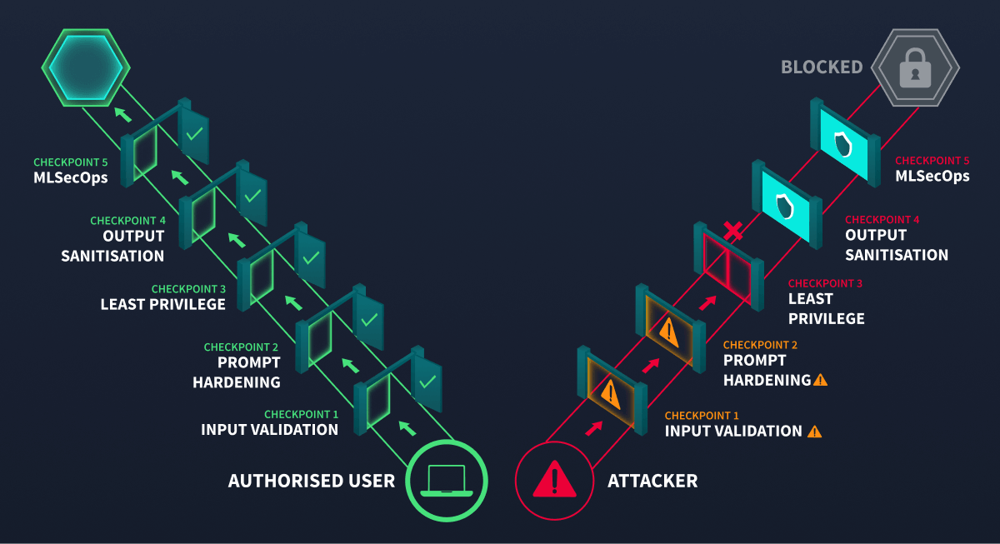

**SECURING AI SYSTEMS**

*User Interface*	Developer-facing chat widget embedded in the code review platform

*API Gateway*	Authentication, rate limiting, request routing

*Orchestration Layer*	Manages conversation state, routes requests, coordinates components

*Prompt Construction*	Combines the system prompt, user query, and retrieved context into the final prompt sent to the model

*LLM*	The language model (hosted internally or accessed via API) that generates responses

*Tool Layer*	Functions the LLM can invoke: database queries, documentation search, CI/CD status checks

*Output Processing*	Response formatting, content filtering, length enforcement

*Logging and Monitoring*	Conversation storage, usage analytics, audit trail

*Vector Store*	Embedded representations of internal documentation for retrieval-augmented generation (RAG)

_______________________________________________________________________
_______________________________________________________________________

**BOUNDARIES**

*user-to-system:* untrusted natural language enters the system 

*System-to-LLM:* constructed prompt is then sent to the model 

*LLM-to-tools:* model output triggers database queries, API calls, or file operations.

*System-to-external-data:* retrieved documents from vector store    or external sources enter the prompt

*system-to-user:* generated response is delivered to the user

_______________________________________________________________________
_______________________________________________________________________

**OWASP LLM TOP 10**

**LLM01**_Prompt injection:_ manipulating llm behaviour through crafted input.
**LLM02**_Sensitive information disclosure:_ leaking confidential information. PII. or system details through responses.
**LLM03**_Supply chain:_ compromised pre-trained models, datasets and third party dependancies introduced before deployement.
**LLM04**_Data and model poisoning:_ corrupt model data, or weights to alter behavious.
**LLM05**_Improper Output handling:_ LLM output is causing injection downstream systems.
**LLM06**_Excessive agency:_ AI components with more previlege or autonomy than necessary.
**LLM07**_System prompt leakage:_ Exposure of system level instructions and internal configuration.
**LLM08**_Vector and embedding weaknesses:_ Exploiting retrieval mechanisms and embedding pipelines.
**LLM09**_Misinformation:_ LLM generating false or misleading content.
**LLM010**_Unbounded Consumption:_ Resource exhaustion, cost explosion, denial of service.

__________________________________________________________________________________________________________________________________________________________________________________

_unbounded consumption:_ attacks that drive up the resources, longer the input, the more computing power the model uses.
**defence:** rate limiting, input length, cost rate limiting.

_system prompt leakage:_ the model reveals hidden operating insutrctions to someone who should not have access to the same.
**defence:** never put your credentials or any secrets into the model.

_improper output handling:_ llm outputs being improperly handled by using it as is without assessing it first hand.
**defence:** never trust LLM output as is.

_Excessive agency:_ giving AI systems more tools than necessary.
**defence:** assign least previlege to the LLM models.

__________________________________________________________________________________________________________________________________________________________________________________

__DEFENCE IN DEPTH FOR AI SYSTEMS__

_User-to-system_	Input length validation, rate limiting, content filtering, and authentication.

_System-to-LLM_	Prompt injection detection, system prompt hardening, context size limits.

_LLM-to-tools_	Parameterised queries, least-privilege tool permissions, and approval workflows for write operations.

_System-to-external-data_	Source validation for retrieved documents, content sanitisation before inclusion in prompts.

_System-to-user_	Output sanitisation, PII redaction, response length limits, and content safety filters.

*LEAST PREVILEGE*

*Database access:* Read-only by default. Write permissions require explicit justification for each specific operation.

*API tokens:* Scoped to the exact endpoints the tool needs. Never use admin or root-level tokens.

*Tool allowlisting:* The LLM can only invoke functions that have been explicitly registered. Any attempt to call an unregistered function is blocked and logged.

*Human-in-the-loop:* Any operation that modifies state (deploying code, updating records, sending communications) requires human approval before execution.

